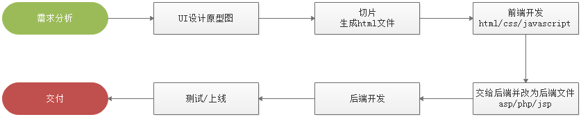
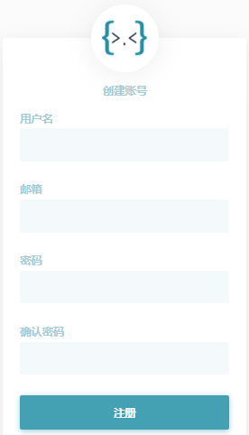
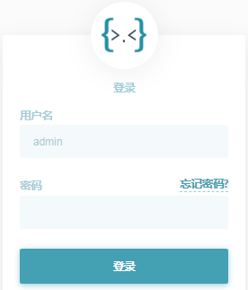
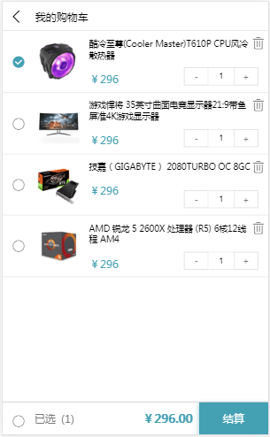

# 1 介绍

## 1.1 课程目标

- 了解项目基本开发流程

- 了解前后端分离项目架构

- 了解具体业务逻辑

- 了解接口文档的作用及规范

- 熟练运用之前所讲部份知识点

- 熟悉JWT跨域认证方案

## 1.2 时间安排

| 功能                   | 讲解/开发时间 | 时长   |
| ---------------------- | ------------- | ------ |
| 项目整体介绍及开发流程 | 9:00--9:40    | 40分钟 |
| 配置接口服务地址       | 9:40--9:50    | 10分钟 |
| 休息                   | 9:50--10:00   |        |
| 会员注册               | 10:00--10:30  | 30分钟 |
| 会员登录               | 10:30--11:00  | 30分钟 |
| 休息                   | 11:00--11:10  |        |
| 商品列表               | 11:10--12:00  | 50分钟 |
| 休息                   | 12:00--14:00  |        |
| 查看商品               | 14:00--14:30  | 30分钟 |
| 添加购物               | 14:30--15:00  | 30分钟 |
| 休息                   | 15:00--15:10  |        |
| 查看购物               | 15:10--15:50  | 40分钟 |
| 休息                   | 15:50--16:00  |        |
| 删除购物               | 16:00--16:30  | 30分钟 |
| 修改购物               | 16:30--17:00  | 30分钟 |
| 总结及分享             | 18:00--19:00  | 60分钟 |

# 2 项目开发流程

## 2.1 传统的项目开发流程

## 2.2 前后端分离项目开发流程

## 2.3 前后端分离项目架构图

# 3 前端实现

## 3.1 会员模块

需要实现：

1、输入用户名、密码、邮箱，点击注册按钮将数据发送至服务器进行注册

2、输入用户名、密码，完成用户登录功能，保存令牌至本地存储

## 3.2 商品模块

需要实现：

1、页面载入后，请求商品信息渲染至页面中，并且分页显示。点击分页按钮，实现分页效果

2、用户在搜索商品时，根据输入内容请求商品信息渲染至页面中，并且分页显示

3、点击商品图片或名称，进入商品详情页并传入商品ID，根据ID获取商品详情，渲染至页面中

## 3.3 购物车模块

需要实现：

1、点击商品右上方小购物车图标，将对应商品添加至购物车

2、点击商品页中右下方大购物车图标，跳转至购物车页面，载入时，加载当前用户购物车中商品，显示在页面中

3、点击购物车中的删除按钮，删除当前商品

4、点击“+-”符号，完成购买商品数量的修改

## 3.4 准备工作-配置接口服务地址

C:\Windows\System32\drivers\etc\hosts

~~~ini
#127.0.0.1    	localhost
192.168.50.200	www.shop.com
~~~

# 4 接口服务

## 4.1 会员注册功能

接口功能：接收用户名和密码，完成用户的注册操作

请求地址：http://www.shop.com/api/member/register

请求方式：post

参数列表

| 参数     | 数据类型 | 是否必须 | 说明           |
| -------- | -------- | -------- | -------------- |
| username | 字符串   | 是       | 用户名，长度20 |
| password | 字符串   | 是       | 密码，长度20   |
| email    | 字符串   | 是       | 邮箱，长度30   |

返回结果

| 属性 | 数据类型 | 说明                                                |
| ---- | -------- | --------------------------------------------------- |
| code | 数值     | 状态码：0 失败 1 成功 2 该用户名已被注册 3 参数错误 |
| msg  | 字符串   | 是否注册成功相关信息                                |

示例：

~~~javascript
{
    "code": 1,
    "msg": "注册成功"
}
~~~

## 4.2 会员登录功能

接口功能：接收用户名和密码，查询该会员是否已经注册，完成登录功能，返回token

请求地址：http://www.shop.com/api/member/login

请求方式：post

参数列表

| 参数     | 数据类型 | 是否必须 | 说明           |
| -------- | -------- | -------- | -------------- |
| username | 字符串   | 是       | 用户名，长度20 |
| password | 字符串   | 是       | 密码，长度20   |

返回结果

| 属性  | 数据类型 | 说明                            |
| ----- | -------- | ------------------------------- |
| code  | 数值     | 状态码：0 失败 1 成功 3参数错误 |
| msg   | 字符串   | 是否登录成功相关信息            |
| token | 字符串   | 令牌，其中包含用户身份          |

示例：

~~~javascript
{
	"msg":"登录成功",
	"code":1,     		
    "token":"xxxxxxxxxxx.yyyyyyyyyyyyy.zzzzzzzzzzzzz"
}
~~~

## 4.3 查看商品列表

接口功能：查看所有商品信息，并同时支持分页与搜索功能

请求地址：http://www.shop.com/api/goods/getList

请求方式：get

参数列表

| 参数   | 数据类型 | 是否必须 | 说明             |
| ------ | -------- | -------- | ---------------- |
| page   | 数值     | 否       | 页码     默认：1 |
| search | 字符串   | 否       | 搜索关键字       |

返回结果

| 属性      | 数据类型 | 说明                          |
| --------- | -------- | ----------------------------- |
| code      | 数值     | 状态码：0 没有数据 1 查询成功 |
| msg       | 字符串   | 是否查询成功相关信息          |
| pageCount | 数值     | 分页总数                      |
| pageNo    | 数值     | 总页数                        |
| pageSize  | 数值     | 页尺寸                        |
| total     | 数值     | 商品总数量                    |
| data      | 对象     | 商品数据                      |

示例：

~~~javascript
{
    "code":1,
    "msg":"查询成功",
    "pageCount": 3
	"pageNo": 1
	"pageSize": 4
	"total": 12
    "data":[
        {
            "id":3,
            "name":"李宁青少年男女足球鞋碎钉儿童训练鞋学生人造草地ASTK029",
            "price":"199",
            "fileurl":"\/uploads\/1.jpg",
            "content":"李宁碎钉足球训练鞋，采用简洁的色彩搭配，简单时尚。 "
        },
        {
            "id":4,
            "name":"花花公子男装短袖T恤男夏季新款修身圆领打底衫半袖衣服潮流体恤",
            "price":"168",
            "fileurl":"\/uploads\/2.jpg",
            "content":"品牌: PLAYBOY\/花花公子货号: RT191919基础风格: 青春流行上市年份季节"
        }
    ]
}
~~~

## 4.4 查看商品信息

接口功能：查看当前商品信息

请求地址：http://www.shop.com/api/goods/getInfo

请求方式：get

参数列表：

| 参数 | 数据类型 | 是否必须 | 说明   |
| ---- | -------- | -------- | ------ |
| id   | 数值     | 是       | 商品ID |

返回结果

| 属性 | 数据类型 | 说明                             |
| ---- | -------- | -------------------------------- |
| code | 数值     | 状态码：0 失败 1 成功 3 参数错误 |
| msg  | 字符串   | 是否查询成功相关信息             |
| data | 对象     | 商品数据                         |

示例

~~~javascript
{
    "code": 1,
    "msg": "ok",
    "data": {
        "id": 4,
        "name": "花花公子男装短袖T恤男夏季新款修身圆领打底衫半袖衣服潮流体恤",
        "price": "168",
        "fileurl": "/uploads/2.jpg",
        "content": "品牌: PLAYBOY/花花公子货号: RT191919基础风格: 青春流行上市年份季节: 2019年"
    }
}
~~~

## 4.5 添加购物车

接口功能：将当前选中商品添加至购物车

请求地址：http://www.shop.com/api/cart/add

请求方式：get

参数列表：

| 参数  | 数据类型 | 是否必须 | 说明     |
| ----- | -------- | -------- | -------- |
| gid   | 数值     | 是       | 商品ID   |
| price | 数值     | 是       | 商品单价 |
| token | 字符串   | 是       | 令牌     |

返回结果

| 属性 | 数据类型 | 说明                                                   |
| ---- | -------- | ------------------------------------------------------ |
| code | 数值     | 状态码：0 没有数据 1 添加成功  2 商品已存在 3 参数错误 |
| msg  | 字符串   | 是否添加成功相关信息                                   |

示例

~~~javascript
{
    "code": 1,
    "msg": "添加成功",
}
~~~

## 4.6 查看购物车

接口功能：查看当前会员购物车中的所有商品

请求地址：http://www.shop.com/api/cart/getList

请求方式：get

参数列表

| 参数  | 数据类型 | 是否必须 | 说明 |
| ----- | -------- | -------- | ---- |
| token | 字符串   | 是       | 令牌 |

返回结果

| 属性 | 数据类型 | 说明                          |
| ---- | -------- | ----------------------------- |
| code | 数值     | 状态码：0 没有数据 1 查询成功 |
| msg  | 字符串   | 是否查询成功相关信息          |
| data | 对象     | 商品数据                      |

示例

~~~javascript
{
    "code":1,
    "msg":"共有2条数据",
    "data":[
        {
            "id":174,
            "name":"PURE＆MILD\/泊美鲜纯珍萃柔亮保湿面霜滋润",
            "price":"100",
            "fileurl":"\/uploads\/3.jpg",
            "num":1
        },
        {
            "id":175,
            "name":"花花公子男装短袖T恤男夏季新款修身圆领打底衫半袖衣服潮流体恤",
            "price":"100",
            "fileurl":"\/uploads\/2.jpg",
            "num":1
         }
    ]
}
~~~

## 4.7 删除购物车

接口功能：删除当前会员购物车中的对应商品

请求地址：http://www.shop.com/api/cart/remove

请求方式：get

参数列表

| 参数  | 数据类型 | 是否必须 | 说明   |
| ----- | -------- | -------- | ------ |
| id    | 数值     | 是       | 数据ID |
| token | 字符串   | 是       | 令牌   |

返回结果

| 属性 | 数据类型 | 说明                                     |
| ---- | -------- | ---------------------------------------- |
| code | 数值     | 状态码：0 删除失败 1 删除成功 3 参数错误 |
| msg  | 字符串   | 是否删除成功相关信息                     |

示例

~~~javascript
{
    "code": 1,
    "msg": "删除成功",
}
~~~

## 4.8 修改购物车

接口功能：修改购物车中对应商品的数量

请求地址：http://www.shop.com/api/cart/edit

请求方式：get

参数列表 

| 参数  | 数据类型 | 是否必须 | 说明     |
| ----- | -------- | -------- | -------- |
| token | 字符串   | 是       | 令牌     |
| id    | 数值     | 是       | 数据ID   |
| num   | 数值     | 是       | 商品数量 |

返回结果

| 属性 | 数据类型 | 说明                                     |
| ---- | -------- | ---------------------------------------- |
| code | 数值     | 状态码：0 修改失败 1 修改成功 3 参数错误 |
| msg  | 字符串   | 是否修改成功相关信息                     |

示例

~~~javascript
{
    "code": 1,
    "msg": "修改成功"
}
~~~
