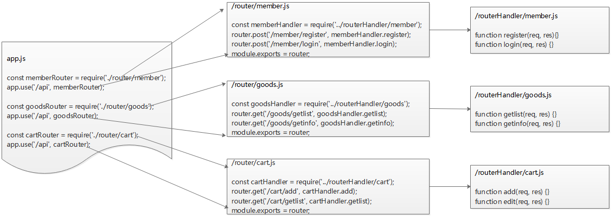

# 1 课程介绍

## 1.1 课程目标

熟练掌握Node.js课程涵盖的知识点

了解后端API项目的开发流程

熟悉接口文档的作用

掌握后端主要业务逻辑的开发流程

具备通过文档开发接口的能力

## 1.2 涵盖知识点

## 1.3 参考时间

# 2 搭建项目框架

## 2.1 项目目录结构

新建`shop`文件夹，做为项目根目录，并完成以下项目结构的搭建

~~~
/									//项目根目录

/config								//配置文件目录
/config/config.js					//配置文件
/config/db.js						//数据库连接文件

/router								//路由模块目录
/router/cart.js						//购物车路由模块
/router/goods.js					//商品路由模块
/router/member.js					//会员路由模块

/routerHandler						//路由处理函数模块目录
/routerHandler/cart.js				//购物车路由处理函数模块
/routerHandler/goods.js				//商品路由处理函数模块
/routerHandler/member.js			//会员路由处理函数模块

/uploads							//商品图片文件
/uploads/1.jpg
/uploads/2.jpg
/uploads/....

/app.js								//入口文件
/package.json						//包管理配置文件
~~~

## 2.2 初始化包管理

进入根目录，运行以下命令，初始化包管理配置文件

~~~bash
npm init -y
~~~

## 2.3 安装相关模块

- [ ] **安装express模块**

在根目录下，运行以下命令，安装指定版本的express

~~~bash
npm i express@4.17.1
~~~

- [ ] **安装mysql模块**

在根目录下，运行以命令，安装mysql模块，用于操作mysql数据库

~~~bash
npm i mysql@2.18.1
~~~

- [ ] **安装moment模块**

在根目录下，运行以下命令，安装moment模块

~~~bash
npm i moment
~~~

- [ ] **安装cors中间件**

在根目录下，运行以下命令，安装指定版本的cors

~~~bash
npm i cors@2.8.5
~~~

- [ ] **安装jwt相关模块**

在根目录下，运行以下命令，安装jsonwebtoken和express-jwt模块

~~~bash
npm i jsonwebtoken express-jwt
~~~

## 2.4 初始化项目配置文件

为了便于程序后期扩展和维护，我们将一些公共信息存放在配置文件目录下，如数据库配置信息：

打开`config/config.js`，添加内容如下：

~~~javascript
const config = {
    SUCCESS: 				{ code: 2000, msg: '操作成功' },
    FAIL: 					{ code: 4000, msg: '操作失败' },

    USER_LOGIN: 			{ code: 2001, msg: '注册成功' },
    USER_REGISTER: 			{ code: 2002, msg: '登录成功' },

    PARAM_MISSING: 			{ code: 4101, msg: '缺少参数' },
    PARAM_NULL: 			{ code: 4102, msg: '参数值不能为空' },
    PARAM_PAGE_INVALID: 	{ code: 4103, msg: '页码参数无效' },
    PARAM_GOODSID_INVALID: 	{ code: 4104, msg: '商品参数无效' },
    PARAM_NUM_INVALID: 		{ code: 4105, msg: '数量参数无效' },
    PARAM_INVALID:			{ code: 4106, msg: '参数无效'},

    USER_EXIST: 			{ code: 4201, msg: '用户名已存在' },
    USER_NOT_EXIST: 		{ code: 4202, msg: '用户名不存在' },
    USER_PWD_ERROR: 		{ code: 4203, msg: '密码错误' },
    USER_EXPIR: 			{ code: 4204, msg: '登录时间过期' },
    USER_ERROR: 			{ code: 4205, msg: '用户身份错误' }
};

module.exports = config;
~~~

## 2.5 初始化数据库连接文件

在`/config`目录下新建文件`db.js`，用于返回数据库连接对象

~~~javascript
const config = {
    host: '127.0.0.1',
    port: '3306',
    user: 'root',
    password: 'root',
    database: 'www.shop.com'
};

const mysql = require('mysql');
const db = mysql.createPool(config);

module.exports = db;
~~~

# 3 入口文件

## 3.1 初始化入口文件

在根目录下，新建`app.js`做为项目入口文件，代码如下：

~~~javascript
const express = require('express');
const app = express();

app.listen(80, function() {
    console.log('server running at http://localhost:80...');
});
~~~

## 3.2 配置cors跨域

在app.js入口文件中，导入并配置cors中间件，配置cors跨域，代码如下,

~~~javascript
const cors = require('cors');
app.use(cors());
~~~

## 3.3 配置解析表单数据中间件

在app.js文件中，通过以下代码，配置表单数据解析的中间件

~~~javascript
app.use(express.urlencoded({ extended: false }));
~~~

## 3.4 托管静态资源

~~~javascript
app.use(express.static('/uploads/'));
~~~

## 3.5 配置接口服务地址

C:\Windows\System32\drivers\etc\hosts

~~~ini
#127.0.0.1   localhost
127.0.0.1	www.shop.com
~~~

# 4 配置路由及路由处理函数

## 4.1 路由模块结构示意图

## 4.2 会员模块路由

- [ ] **定义会员路由**

在`/routerHandler/member.js`文件中，定义会员路由处理函数，代码如下：

~~~javascript
function register(req, res) {
}

function login(req, res) {
}

module.exports = {
    register,
    login
}
~~~

- [ ] **定义会员路由处理函数**

 在`/router/member.js`文件中，定义会员模块的访问路由，代码如下：

~~~javascript
const express = require('express');
const router = express.Router();

const memberHandler = require('../routerHandler/member');

router.get('/member/register', memberHandler.register);
router.get('/member/login', memberHandler.login);

module.exports = router;
~~~

## 4.3 商品模块路由

- [ ] **定义商品路由**

在`/routerHandler/goods.js`文件中，定义商品路由处理函数，代码如下：

~~~javascript
function getlist(req, res){
};

function getinfo(req, res){
};

module.exports = {
    getlist,
    getinfo
}
~~~

- [ ] **定义商品路由处理函数**

在`/router/goods.js`文件中，定义商品模块的访问路由，代码如下：

~~~javascript
const express = require('express');
const router = express.Router();

const goodsHandler = require('../routerHandler/goods');

router.get('/goods/getlist', goodsHandler.getlist);
router.get('/goods/getinfo', goodsHandler.getinfo);

module.exports = router;
~~~

## 4.4 购物车模块路由

- [ ] **定义购物车路由**

在`/routerHandler/cart.js`文件中，定义购物车模块的路由处理函数，代码如下：

~~~javascript
function add(req, res) {
}

function getlist(req, res) {
}

function remove(req, res) {
}

function edit(req, res) {
}

module.exports = {
    add,
    getlist,
    remove,
    edit
}
~~~

- [ ] **定义购物车路由处理函数**

在`/router/cart.js`文件中，定义购物车模块的访问路由，代码如下：

~~~javascript
const express = require('express');
const router = express.Router();

const cartHandler = require('../routerHandler/cart');

router.get('/cart/add', cartHandler.add);
router.get('/cart/getlist', cartHandler.getlist);
router.get('/cart/remove', cartHandler.remove);
router.get('/cart/edit', cartHandler.edit);

module.exports = router;
~~~

## 4.5 引入路由定义模块 

在入口文件`app.js`中，引入以上三个定义路由模块，并定义访问前缀`api`

~~~javascript
const memberRouter = require('./router/member');
app.use('/api', memberRouter);

const goodsRouter = require('./router/goods');
app.use('/api', goodsRouter);

const cartRouter = require('./router/cart');
app.use('/api', cartRouter);
~~~

# 5 会员模块

## 5.1 会员数据表

| 字段     | 数据类型 | 说明             |
| -------- | -------- | ---------------- |
| id       | 数值     | ID主键，唯一标识 |
| username | 字符串   | 用户名           |
| password | 字符串   | 密码             |
| email    | 字符串   | 邮箱地址         |
| r_date   | 日期时间 | 注册时间         |
| l_date   | 日期时间 | 最后登录时间     |

## 5.2 会员注册

### 5.2.1 接口功能

接口功能：接收用户名、密码、邮箱，完成用户的注册操作

请求地址：http://www.shop.com/api/member/register

请求方式：post

参数列表

| 参数     | 数据类型 | 是否必须 | 说明           |
| -------- | -------- | -------- | -------------- |
| username | 字符串   | 是       | 用户名，长度20 |
| password | 字符串   | 是       | 密码，长度20   |
| email    | 字符串   | 是       | 邮箱，长度30   |

返回结果

| 属性 | 数据类型 | 说明                        |
| ---- | -------- | --------------------------- |
| code | 数值     | 状态码：2000 成功 4000 失败 |
| msg  | 字符串   | 是否注册成功相关信息        |

示例：

~~~javascript
{
    "code": 2000,
    "msg": "注册成功"
}
~~~

### 5.2.2 实现步骤

- [ ] 导入相关模块
- [ ] 接收参数并验证有效性
- [ ] 检查用户名是否存在
- [ ] 插入数据表并返回结果

### 5.2.3 导入相关模块

~~~javascript
const moment = require('moment');
const db = require('../config/db');
const CONFIG = require('../config/config');
~~~

### 5.2.4 接收参数并验证有效性

~~~javascript
//接收参数
const params = {
    username: req.body.username,
    password: req.body.password,
    email: req.body.email,
    r_date: moment().format('YYYY-MM-DD')
}

//验证参数有效性
......
~~~

### 5.2.5 检查用户名是否存在

~~~javascript
let sqlStr = `select id from member where username=${params.username}`;
db.query(sqlStr, (err, rst) =>{
});
~~~

### 5.2.6 插入数据表并返回结果

~~~javascript
let sqlStr = "insert into member set ?";
db.query(sqlStr, param, (err, rst)=>{
});
~~~

## 5.3 会员登录

### 5.3.1 接口功能

接口功能：接收用户名和密码，查询该会员是否已经注册，完成登录功能，返回token

请求地址：http://www.shop.com/api/member/login

请求方式：post

参数列表

| 参数     | 数据类型 | 是否必须 | 说明           |
| -------- | -------- | -------- | -------------- |
| username | 字符串   | 是       | 用户名，长度20 |
| password | 字符串   | 是       | 密码，长度20   |

返回结果

| 属性  | 数据类型 | 说明                        |
| ----- | -------- | --------------------------- |
| code  | 数值     | 状态码：2000 成功 4000 失败 |
| msg   | 字符串   | 是否登录成功相关信息        |
| token | 字符串   | 令牌，其中包含用户身份      |

示例：

~~~javascript
{
	"msg":"登录成功",
	"code":2000,     		
    "token":"xxxxxxxxxxx.yyyyyyyyyyyyy.zzzzzzzzzzzzz"
}
~~~

### 5.3.2 实现步骤

- [ ] 导入相关模块
- [ ] 接收参数并验证有效性
- [ ] 查询该用户的密码字段
- [ ] 比对密码生成JWT

### 5.3.3 导入数据库连接对象

~~~javascript
const db = require('../config/db');
const CONFIG = require('../config/config');
~~~

### 5.3.4 接收参数并判断是否有效

~~~javascript
const param = {
    username: req.body.username,
    password: req.body.password
};
~~~

### 5.3.5 查询该用户的密码字段

~~~javascript
let sqlStr = "select password from member where username=?";
db.query(sqlStr, [username], (err, rst)=>{
});
~~~

### 5.3.6 比对密码生成JWT

~~~javascript
//导入jwt模块，生成jwt字符串
const jwt = require('jsonwebtoken');
let jwtStr = jwt.sign({ username: param.username }, RESULT.JWT_SECRET, { expiresIn: RESULT.JWT_EXPIR });

//将jwt字符串写入返回值
RESULT.USER_LOGIN.jwt = jwtStr;
                
//返回结果
return res.send(RESULT.USER_LOGIN);
~~~

# 6 商品模块

## 6.1 商品表

| 字段    | 数据类型 | 说明             |
| ------- | -------- | ---------------- |
| id      | 数值     | ID主键，唯一标识 |
| name    | 字符串   | 用户名           |
| price   | 货币     | 单价             |
| fileurl | 字符串   | 图片地址         |
| content | 文本     | 商品描述信息     |

## 6.2 商品列表

### 6.2.1 接口功能

接口功能：查看所有商品信息，并同时支持分页与搜索功能

请求地址：http://www.shop.com/api/goods/getlist

请求方式：get

参数列表

| 参数   | 数据类型 | 是否必须 | 说明             |
| ------ | -------- | -------- | ---------------- |
| page   | 数值     | 否       | 页码     默认：1 |
| search | 字符串   | 否       | 搜索关键字       |

返回结果

| 属性      | 数据类型 | 说明                        |
| --------- | -------- | --------------------------- |
| code      | 数值     | 状态码：2000 成功 4000 失败 |
| msg       | 字符串   | 是否查询成功相关信息        |
| pageCount | 数值     | 分页总数                    |
| pageNo    | 数值     | 总页数                      |
| pageSize  | 数值     | 页尺寸                      |
| total     | 数值     | 商品总数量                  |
| data      | 对象     | 商品数据                    |

示例：

~~~javascript
{
    "code":2000,
    "msg":"查询成功",
    "pageCount": 3
	"pageNo": 1
	"pageSize": 4
	"total": 12
    "data":[
        {
            "id":3,
            "name":"李宁青少年男女足球鞋碎钉儿童训练鞋学生人造草地ASTK029",
            "price":"199",
            "fileurl":"\/uploads\/1.jpg",
            "content":"李宁碎钉足球训练鞋，采用简洁的色彩搭配，简单时尚。 "
        },
        {
            "id":4,
            "name":"花花公子男装短袖T恤男夏季新款修身圆领打底衫半袖衣服潮流体恤",
            "price":"168",
            "fileurl":"\/uploads\/2.jpg",
            "content":"品牌: PLAYBOY\/花花公子货号: RT191919基础风格: 青春流行上市年份季节"
        }
    ]
}
~~~

### 6.2.2 实现步骤

- [ ] 导入相关模块
- [ ] 接收参数并验证有效性
- [ ] 定义对应分页参数
- [ ] 查询数据总数
- [ ] 查询当前页数据并返回

### 6.2.3 导入相关模块

~~~javascript
let CONFIG = require('../config/config');
let db = require('../config/db');
~~~

### 6.2.4 接收参数并验证有效性

~~~javascript
let page = req.query.page || 1;
let search = req.query.search || '';
~~~

### 6.2.5 定义对应分页参数

~~~javascript
let total = 0;
let offset = 0;
let pageCount = 0;
let pageSize = 6;
~~~

### 6.2.6 查询数据总数

~~~javascript
let sqlStr = `select count(*) as num from goods where name like '%${search}%'`;
db.query(sqlStr, (err, rst) => {
});
~~~

### 6.2.7 查询当前页数据并返回

~~~javascript
sqlStr = `select * from goods where name like '%${search}%' limit ${offset},${pageSize}`;
db.query(sqlStr, (err, rst) => {
});
~~~

## 6.3 查看商品信息

### 6.3.1 接口功能

接口功能：查看当前商品信息

请求地址：http://www.shop.com/api/goods/getInfo

请求方式：get

参数列表：

| 参数 | 数据类型 | 是否必须 | 说明   |
| ---- | -------- | -------- | ------ |
| id   | 数值     | 是       | 商品ID |

返回结果

| 属性 | 数据类型 | 说明                        |
| ---- | -------- | --------------------------- |
| code | 数值     | 状态码：2000 成功 4000 错误 |
| msg  | 字符串   | 是否查询成功相关信息        |
| data | 对象     | 商品数据                    |

示例

~~~javascript
{
    "code": 1,
    "msg": "ok",
    "data": {
        "id": 4,
        "name": "花花公子男装短袖T恤男夏季新款修身圆领打底衫半袖衣服潮流体恤",
        "price": "168",
        "fileurl": "/uploads/2.jpg",
        "content": "品牌: PLAYBOY/花花公子货号: RT191919基础风格: 青春流行上市年份季节: 2019年"
    }
}
~~~

### 6.3.2 实现步骤

- [ ] 导入相关模块
- [ ] 接收参数并验证有效性
- [ ] 查询对应商品信息并返回

### 6.3.3 导入相关模块

~~~javascript
let CONFIG = require('../config/config');
let db = require('../config/db');
~~~

### 6.3.4 接收参数并验证有效性

~~~javascript
let id = req.query.id;
~~~

### 6.3.5 查询对应商品信息并返回

~~~javascript
let sqlStr = `select * from goods where id=${id}`;
db.query(sqlStr, (err, rst) => {
});
~~~

# 7 购物车模块

## 7.1 购物车表

| 字段  | 数据类型 | 说明             |
| ----- | -------- | ---------------- |
| id    | 数值     | ID主键，唯一标识 |
| mid   | 数值     | 会员ID           |
| gid   | 数值     | 商品ID           |
| num   | 数值     | 购买数量         |
| price | 货币     | 单价             |

## 7.2 添加购物车

### 7.2.1 接口功能

接口功能：将当前选中商品添加至购物车

请求地址：http://www.shop.com/api/cart/add

请求方式：get

参数列表：

| 参数  | 数据类型 | 是否必须 | 说明     |
| ----- | -------- | -------- | -------- |
| gid   | 数值     | 是       | 商品ID   |
| price | 数值     | 是       | 商品单价 |
| token | 字符串   | 是       | 令牌     |

返回结果

| 属性 | 数据类型 | 说明                                                   |
| ---- | -------- | ------------------------------------------------------ |
| code | 数值     | 状态码：0 没有数据 1 添加成功  2 商品已存在 3 参数错误 |
| msg  | 字符串   | 是否添加成功相关信息                                   |

示例

~~~javascript
{
    "code": 1,
    "msg": "添加成功",
}
~~~

### 7.2.2 实现步骤

- [ ] 导入相关模块
- [ ] 接收参数并判断有效性
- [ ] 判断商品ID有效性
- [ ] 判断商品是否已添加
- [ ] 插入数据库并返回结果

### 7.2.3 导入相关模块

~~~javascript
let CONFIG = require('../config/config');
let db = require('../config/db');
~~~

### 7.2.4 接收参数并判断有效性

~~~javascript
const params = {
	gid: req.require.gid,
    price: req.require.price,
    num: req.require.num,
    userid: ''
};
~~~

### 7.2.5 判断商品ID有效性

~~~javascript
let sqlStr = `select id from goods where id=${id}`;
db.query(sqlStr,  (err, rst) => {
});
~~~

### 7.2.6 判断商品是否已添加

~~~javascript
let sqlStr = `select * from cart where gid=${gid} and uid=${uid}`;
db.query(sqlStr, (err, rst) => {
});
~~~

### 7.2.7 插入数据库并返回结果

~~~javascript
let sqlStr = "insert into cart set ?";
db.query(sqlStr, params, (err, rst) => {
});
~~~

## 7.3 查询购物车中所有商品

### 7.3.1 接口功能

接口功能：查看当前会员购物车中的所有商品

请求地址：http://www.shop.com/api/cart/getlist

请求方式：get

参数列表

| 参数  | 数据类型 | 是否必须 | 说明 |
| ----- | -------- | -------- | ---- |
| token | 字符串   | 是       | 令牌 |

返回结果

| 属性 | 数据类型 | 说明                          |
| ---- | -------- | ----------------------------- |
| code | 数值     | 状态码：0 没有数据 1 查询成功 |
| msg  | 字符串   | 是否查询成功相关信息          |
| data | 对象     | 商品数据                      |

示例

~~~javascript
{
    "code":1,
    "msg":"共有2条数据",
    "data":[
        {
            "id":174,
            "name":"PURE＆MILD\/泊美鲜纯珍萃柔亮保湿面霜滋润",
            "price":"100",
            "fileurl":"\/uploads\/3.jpg",
            "num":1
        },
        {
            "id":175,
            "name":"花花公子男装短袖T恤男夏季新款修身圆领打底衫半袖衣服潮流体恤",
            "price":"100",
            "fileurl":"\/uploads\/2.jpg",
            "num":1
         }
    ]
}
~~~

### 7.3.2 实现步骤

- [ ] 导入相关模块
- [ ] 获取用户身份
- [ ] 查询该用户购物车中所有商品

### 7.3.3 导入相关模块

~~~javascript
let CONFIG = require('../config/config');
let db = require('../config/db');
~~~

### 7.3.4 获取用户身份

~~~

~~~

### 7.3.5 查询该用户购物车

~~~javascript
let sqlStr = `select * from where uid=${userid} and goods.id=cart.uid`;
db.query(sqlStr, params, (err, rst) => {
});
~~~

## 7.4 移除购物车中某件商品

### 7.4.1 接口功能

接口功能：删除当前会员购物车中的对应商品

请求地址：http://www.shop.com/api/cart/remove

请求方式：get

参数列表

| 参数  | 数据类型 | 是否必须 | 说明   |
| ----- | -------- | -------- | ------ |
| id    | 数值     | 是       | 数据ID |
| token | 字符串   | 是       | 令牌   |

返回结果

| 属性 | 数据类型 | 说明                                     |
| ---- | -------- | ---------------------------------------- |
| code | 数值     | 状态码：0 删除失败 1 删除成功 3 参数错误 |
| msg  | 字符串   | 是否删除成功相关信息                     |

示例

~~~javascript
{
    "code": 1,
    "msg": "删除成功",
}
~~~

### 7.4.2 实现步骤

- [ ] 导入相关模块
- [ ] 接收参数并验证有效性
- [ ] 移除该用户购物车中对应商品

### 7.4.3 导入相关模块

~~~javascript
let CONFIG = require('../config/config');
let db = require('../config/db');
~~~

### 7.4.4 接收参数并验证有效性

~~~

~~~

### 7.4.5 移除该用户购物车中对应商品

~~~javascript
let sqlStr=`delete from cart where gid=${gid} and uid=${uid}`;
db.query(sqlStr,(err,rst)=>{    
});
~~~

## 7.5 修改购物车商品数量

### 7.5.1 接口功能

接口功能：修改购物车中对应商品的数量

请求地址：http://www.shop.com/api/cart/edit

请求方式：get

参数列表 

| 参数  | 数据类型 | 是否必须 | 说明     |
| ----- | -------- | -------- | -------- |
| token | 字符串   | 是       | 令牌     |
| id    | 数值     | 是       | 数据ID   |
| num   | 数值     | 是       | 商品数量 |

返回结果

| 属性 | 数据类型 | 说明                                     |
| ---- | -------- | ---------------------------------------- |
| code | 数值     | 状态码：0 修改失败 1 修改成功 3 参数错误 |
| msg  | 字符串   | 是否修改成功相关信息                     |

示例

~~~javascript
{
    "code": 1,
    "msg": "修改成功"
}
~~~

### 7.5.2 实现步骤

- [ ] 导入相关模块
- [ ] 接收参数并验证有效性
- [ ] 修改商品数量

### 7.5.3 导入相关模块

~~~javascript
let CONFIG = require('../config/config');
let db = require('../config/db');
~~~

### 7.5.4 接收参数并验证有效性

~~~javascript
let gid = req.query.gid;
let num = req.query.num;
~~~

### 7.5.5 修改商品数量

~~~javascript
let sqlStr=`update from cart set num=${num} where uid=${uid} and gid=${gid}`;
db.query(sqlStr,(err,rst)=>{
})
~~~

# 8 总结

