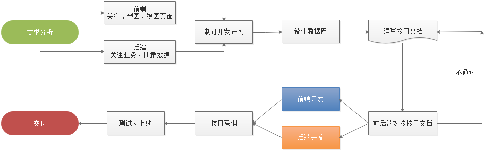

# 1 介绍

## 1.1 课程目标

了解node.js项目开发流程

了解前后端分离项目架构

了解接口业务逻辑

了解接口文档的作用及规范

熟练运用之前所讲部份知识点

熟悉JWT跨域认证方案

## 1.2 时间安排

## 1.2 项目开发流程

### 1.2.1 前后端分离项目开发流程

### 1.2.2 前后端分离项目架构图

# 2 数据库

## 2.1 会员表

| 字段     | 数据类型 | 说明             |
| -------- | -------- | ---------------- |
| id       | 数值     | ID主键，唯一标识 |
| username | 字符串   | 用户名           |
| password | 字符串   | 密码             |
| email    | 字符串   | 邮箱地址         |
| r_date   | 日期时间 | 注册时间         |
| l_date   | 日期时间 | 最后登录时间     |

## 2.2 商品表

| 字段    | 数据类型 | 说明             |
| ------- | -------- | ---------------- |
| id      | 数值     | ID主键，唯一标识 |
| name    | 字符串   | 用户名           |
| price   | 货币     | 单价             |
| fileurl | 字符串   | 图片地址         |
| content | 文本     | 商品描述信息     |

## 2.3 购物车表

| 字段  | 数据类型 | 说明             |
| ----- | -------- | ---------------- |
| id    | 数值     | ID主键，唯一标识 |
| mid   | 数值     | 会员ID           |
| gid   | 数值     | 商品ID           |
| num   | 数值     | 购买数量         |
| price | 货币     | 单价             |

# 3 接口文档

## 3.1 会员注册功能

接口功能：接收用户名和密码，完成用户的注册操作

请求地址：http://www.shop.com/api/member/register

请求方式：post

参数列表

| 参数     | 数据类型 | 是否必须 | 说明           |
| -------- | -------- | -------- | -------------- |
| username | 字符串   | 是       | 用户名，长度20 |
| password | 字符串   | 是       | 密码，长度20   |
| email    | 字符串   | 是       | 邮箱，长度30   |

返回结果

| 属性 | 数据类型 | 说明                                                |
| ---- | -------- | --------------------------------------------------- |
| code | 数值     | 状态码：0 失败 1 成功 2 该用户名已被注册 3 参数错误 |
| msg  | 字符串   | 是否注册成功相关信息                                |

示例：

~~~javascript
{
    "code": 1,
    "msg": "注册成功"
}
~~~

## 3.2 会员登录功能

接口功能：接收用户名和密码，查询该会员是否已经注册，完成登录功能，返回token

请求地址：http://www.shop.com/api/member/login

请求方式：post

参数列表

| 参数     | 数据类型 | 是否必须 | 说明           |
| -------- | -------- | -------- | -------------- |
| username | 字符串   | 是       | 用户名，长度20 |
| password | 字符串   | 是       | 密码，长度20   |

返回结果

| 属性  | 数据类型 | 说明                            |
| ----- | -------- | ------------------------------- |
| code  | 数值     | 状态码：0 失败 1 成功 3参数错误 |
| msg   | 字符串   | 是否登录成功相关信息            |
| token | 字符串   | 令牌，其中包含用户身份          |

示例：

~~~javascript
{
	"msg":"登录成功",
	"code":1,     		
    "token":"xxxxxxxxxxx.yyyyyyyyyyyyy.zzzzzzzzzzzzz"
}
~~~

## 3.3 查看商品列表

接口功能：查看所有商品信息

请求地址：http://www.shop.com/api/goods/getList

请求方式：get

参数列表

| 参数   | 数据类型 | 是否必须 | 说明             |
| ------ | -------- | -------- | ---------------- |
| page   | 数值     | 否       | 页码     默认：1 |
| search | 字符串   | 否       | 搜索关键字       |

返回结果

| 属性      | 数据类型 | 说明                          |
| --------- | -------- | ----------------------------- |
| code      | 数值     | 状态码：0 没有数据 1 查询成功 |
| msg       | 字符串   | 是否查询成功相关信息          |
| pageCount | 数值     | 分页总数                      |
| pageNo    | 数值     | 总页数                        |
| pageSize  | 数值     | 页尺寸                        |
| total     | 数值     | 商品总数量                    |
| data      | 对象     | 商品数据                      |

示例：

~~~javascript
{
    "code":1,
    "msg":"查询成功",
    "pageCount": 3
	"pageNo": 1
	"pageSize": 4
	"total": 12
    "data":[
        {
            "id":3,
            "name":"李宁青少年男女足球鞋碎钉儿童训练鞋学生人造草地ASTK029",
            "price":"199",
            "fileurl":"\/uploads\/1.jpg",
            "content":"李宁碎钉足球训练鞋，采用简洁的色彩搭配，简单时尚。 "
        },
        {
            "id":4,
            "name":"花花公子男装短袖T恤男夏季新款修身圆领打底衫半袖衣服潮流体恤",
            "price":"168",
            "fileurl":"\/uploads\/2.jpg",
            "content":"品牌: PLAYBOY\/花花公子货号: RT191919基础风格: 青春流行上市年份季节"
        }
    ]
}
~~~

## 3.4 查看商品信息

接口功能：查看当前商品信息

请求地址：http://www.shop.com/api/goods/getInfo

请求方式：get

参数列表：

| 参数 | 数据类型 | 是否必须 | 说明   |
| ---- | -------- | -------- | ------ |
| id   | 数值     | 是       | 商品ID |

返回结果

| 属性 | 数据类型 | 说明                             |
| ---- | -------- | -------------------------------- |
| code | 数值     | 状态码：0 失败 1 成功 3 参数错误 |
| msg  | 字符串   | 是否查询成功相关信息             |
| data | 对象     | 商品数据                         |

示例

~~~javascript
{
    "code": 1,
    "msg": "ok",
    "data": {
        "id": 4,
        "name": "花花公子男装短袖T恤男夏季新款修身圆领打底衫半袖衣服潮流体恤",
        "price": "168",
        "fileurl": "/uploads/2.jpg",
        "content": "品牌: PLAYBOY/花花公子货号: RT191919基础风格: 青春流行上市年份季节: 2019年"
    }
}
~~~

## 3.5 添加购物车

接口功能：将当前选中商品添加至购物车

请求地址：http://www.shop.com/api/cart/add

请求方式：get

参数列表：

| 参数  | 数据类型 | 是否必须 | 说明     |
| ----- | -------- | -------- | -------- |
| gid   | 数值     | 是       | 商品ID   |
| price | 数值     | 是       | 商品单价 |
| token | 字符串   | 是       | 令牌     |

返回结果

| 属性 | 数据类型 | 说明                                                   |
| ---- | -------- | ------------------------------------------------------ |
| code | 数值     | 状态码：0 没有数据 1 添加成功  2 商品已存在 3 参数错误 |
| msg  | 字符串   | 是否添加成功相关信息                                   |

示例

~~~javascript
{
    "code": 1,
    "msg": "添加成功",
}
~~~

## 3.6 查看购物车

接口功能：查看当前会员购物车中的所有商品

请求地址：http://www.shop.com/api/cart/getList

请求方式：get

参数列表

| 参数  | 数据类型 | 是否必须 | 说明 |
| ----- | -------- | -------- | ---- |
| token | 字符串   | 是       | 令牌 |

返回结果

| 属性 | 数据类型 | 说明                          |
| ---- | -------- | ----------------------------- |
| code | 数值     | 状态码：0 没有数据 1 查询成功 |
| msg  | 字符串   | 是否查询成功相关信息          |
| data | 对象     | 商品数据                      |

示例

~~~javascript
{
    "code":1,
    "msg":"共有2条数据",
    "data":[
        {
            "id":174,
            "name":"PURE＆MILD\/泊美鲜纯珍萃柔亮保湿面霜滋润",
            "price":"100",
            "fileurl":"\/uploads\/3.jpg",
            "num":1
        },
        {
            "id":175,
            "name":"花花公子男装短袖T恤男夏季新款修身圆领打底衫半袖衣服潮流体恤",
            "price":"100",
            "fileurl":"\/uploads\/2.jpg",
            "num":1
         }
    ]
}
~~~

## 3.7 删除购物车

接口功能：删除当前会员购物车中的对应商品

请求地址：http://www.shop.com/api/cart/remove

请求方式：get

参数列表

| 参数  | 数据类型 | 是否必须 | 说明   |
| ----- | -------- | -------- | ------ |
| id    | 数值     | 是       | 数据ID |
| token | 字符串   | 是       | 令牌   |

返回结果

| 属性 | 数据类型 | 说明                                     |
| ---- | -------- | ---------------------------------------- |
| code | 数值     | 状态码：0 删除失败 1 删除成功 3 参数错误 |
| msg  | 字符串   | 是否删除成功相关信息                     |

示例

~~~javascript
{
    "code": 1,
    "msg": "删除成功",
}
~~~

## 3.8 修改购物车

接口功能：修改购物车中对应商品的数量

请求地址：http://www.shop.com/api/cart/edit

请求方式：get

参数列表 

| 参数  | 数据类型 | 是否必须 | 说明     |
| ----- | -------- | -------- | -------- |
| token | 字符串   | 是       | 令牌     |
| id    | 数值     | 是       | 数据ID   |
| num   | 数值     | 是       | 商品数量 |

返回结果

| 属性 | 数据类型 | 说明                                     |
| ---- | -------- | ---------------------------------------- |
| code | 数值     | 状态码：0 修改失败 1 修改成功 3 参数错误 |
| msg  | 字符串   | 是否修改成功相关信息                     |

示例

~~~javascript
{
    "code": 1,
    "msg": "修改成功"
}
~~~

# 4 搭建项目框架

## 4.1 项目目录结构

新建`shop`文件夹，做为项目目录，`shop/`就是项目的根目录

~~~
/									//项目根目录

/config								//配置文件目录
/config/config.js					//配置文件

/router								//路由模块目录
/router/cart.js						//购物车路由模块
/router/goods.js					//商品路由模块
/router/member.js					//会员路由模块

/routerHandler						//路由处理函数模块目录
/routerHandler/cart.js				//购物车路由处理函数模块
/routerHandler/goods.js				//商品路由处理函数模块
/routerHandler/member.js			//会员路由处理函数模块

/app.js								//入口文件

/package.json						//包管理配置文件
~~~

## 4.2 初始化

1 包管理配置文件

进入根目录，运行以下命令，初始化包管理配置文件

~~~bash
npm init -y
~~~

2 安装express框架

在根目录下，运行以下命令，安装指定版本的express

~~~bash
npm i express@4.17.1
~~~

3 创建入口文件

创建app.js做为项目入口文件，初始化代码如下

~~~javascript
const express = require('express');
const app = express();

app.listen(80, function() {
    console.log('server running at http://localhost:80...');
});
~~~

## 3.2 配置cors跨域

1 安装cors中间件

在根目录下，运行以下命令，安装指定版本的cors

~~~bash
npm i cors@2.8.5
~~~

2 导入并配置cors中间件

在app.js入口文件中，配置cors跨域，代码如下

~~~javascript
const cors = require('cors');
app.use(cors());
~~~

## 3.3 配置解析表单数据中间件

1 配置解析表单数据中间件

在app.js文件中，通过以下代码，配置表单数据解析的中间件

~~~javascript
app.use(express.urlencoded({ extended: false }));
~~~

## 3.4 初始化路由目录

1 创建路由模块目录

在根目录下，新建`router`文件夹，存放所有`路由`模块

2 新建会员路由模块

在router目录下，新建member.js文件，接收和处理会员的请求，代码如下：

~~~javascript
const express = require('express');
const router = express.Router();

router.get('/member/register', (req,res)=>{
    console.log('member register');
    res.send('member register');
});

router.get('/member/login', (req,res)=>{
    console.log('member login');
    res.send('member login');
});

module.exports = router;
~~~

## 3.5 初始化路由处理函数目录

1 创建路由处理函数模块目录

在根目录下，新建`routerHandler`文件夹，存放所有`路由处理函数`模块

2 新建会员路由处理函数路由模块

在`routerHandler`目录下，新建`member.js`文件，将会员路由处理函数封装到此文件中

~~~javascript
exports.register = (req, res) => {
    console.log('memberregister');
    res.send('register');
}

exports.login = (req, res) => {
    console.log('memberlogin');
    res.send('login');
}
~~~

3 修改router目录下member.js路由模块，内容如下：

~~~javascript
const express = require('express');
const router = express.Router();

const memberHandler = require('../routerHandler/member');

router.get('/member/register', memberHandler.register);
router.get('/member/login', memberHandler.login);

module.exports = router;
~~~

4 导入路由模块，配置访问前缀

~~~javascript
const express = require('express');
const app = express();

const cors = require('cors');
app.use(cors());

app.use(express.urlencoded({ extended: false }));

const memberRouter = require('./router/member');
app.use('/api', memberRouter);

app.listen(80, function() {
    console.log('server running at http://localhost:80...');
});
~~~

5 根据以上思路，完成商品和购物由的路由配置，整体项目结构如下

~~~i
					//入口文件
~~~

## 3.6 初始配置文件目录

## 3.7 配置接口服务地址

C:\Windows\System32\drivers\etc\hosts

~~~ini
#127.0.0.1   localhost
127.0.0.1	www.shop.com
~~~

# 5 JWT--跨域认证解决方案

## 5.1 跨域认证问题

## 5.2 什么是JWT

Json web token, 是为了在网络应用环境间传递声明而执行的一种基于JSON的开放标准（[(RFC 7519](https://link.jianshu.com?t=https://tools.ietf.org/html/rfc7519)).该token被设计为紧凑且安全的，特别适用于分布式站点的单点登录（SSO）场景。JWT的声明一般被用来在身份提供者和服务提供者间传递被认证的用户身份信息，以便于从资源服务器获取资源，也可以增加一些额外的其它业务逻辑所必须的声明信息，该token也可直接被用于认证，也可被加密。

**JWT的表现形式就是一个很长的字符串**

## 5.3 JWT原理

JWT是由三段信息构成的，将这三段信息文本用`.`链接一起就构成了Jwt字符串。

- Header（头部）
- Payload（载荷）
- Signature（签名）

### 5.3.1 Header（头部）

Header 部分是一个 JSON 对象，描述 JWT 的元数据，通常是下面的样子。

~~~javascript
{
      "alg": "HS256",
      "typ": "JWT"
}
~~~

alg属性表示签名的算法（algorithm），默认是 HMAC SHA256（写成 HS256）；typ属性表示这个令牌（token）的类型（type），JWT 令牌统一写为JWT。

将上面的 JSON 对象使用 Base64URL 算法转成字符串，这样就构成了第一部分的信息。

### 5.3.2 Payload（载荷）

Payload 部分也是一个 JSON 对象，用来存放实际需要传递的数据。JWT 规定了7个官方字段，供选用。

- iss (issuer)：签发人
- **exp (expiration time)：过期时间**
- sub (subject)：主题
- aud (audience)：受众
- nbf (Not Before)：生效时间
- iat (Issued At)：签发时间
- jti (JWT ID)：编号

~~~javascript
{
      "name": "John Doe",
      "admin": true,
      "exp":145677782363
}
~~~

将上面的 JSON 对象使用 Base64URL 算法转成字符串，这样就构成了第二部分的信息。

### 5.3.3 Signature（签名）

Signature 部分是对前两部分的签名，防止数据篡改。

首先，需要指定一个密钥（secret）。这个密钥只有服务器才知道，不能泄露给用户。然后，使用 Header 里面指定的签名算法（默认是 HMAC SHA256），按照下面的公式产生签名。

~~~javascript
HMACSHA256(base64UrlEncode(header) + "." + base64UrlEncode(payload), secret)
~~~

以上内容构成第三部份的信息。

**将以上三个字符串，使用`.`拼接在一起，就构成了符合JWT标准的token字符串**

## 5.4 如何使用JWT

客户端收到服务器返回的 JWT，可以储存在 Cookie 里面，也可以储存在 localStorage。

此后，客户端每次与服务器通信，都要带上这个 JWT。你可以把它放在 Cookie 里面自动发送，但是这样不能跨域，所以更好的做法是放在 HTTP 请求的头信息Authorization字段里面。

> Authorization: Bearer <token>

另一种做法是，跨域的时候，JWT 就放在请求的参数里面。

